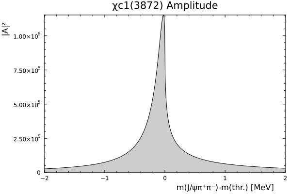

# χc1(3872) Flatte model example


This tutorial builds the default LHCb point-8 model, inspects its decay channels, draws a basic lineshape, computes the pole position, and evaluates naive branching ratios.

## Channel thresholds

Decay channels are stored on the model as typed channel objects.

``` julia
D⁰, D⁺, other, ρ, ω = default_model.channels
(
    neutral_DxD = threshold(D⁰),
    charged_DxD = threshold(D⁺),
    other = threshold(other),
    Jpsi_rho = threshold(ρ),
    Jpsi_omega = threshold(ω),
)
```

    (neutral_DxD = 3.87168, charged_DxD = 3.87984, other = -Inf, Jpsi_rho = 3.37604, Jpsi_omega = 3.51561)

## Basic shape

The Flatte amplitude is evaluated as a function of the energy relative to the neutral `D*0 D0` threshold. A minimal shape calculation needs only a model, an energy grid, and `AJψππ`.

``` julia
energies = range(-2, 2, length = 500) # MeV
intensity = [abs2(AJψππ(default_model, E)) for E in energies]

(
    peak_energy = energies[argmax(intensity)],
    peak_intensity = maximum(intensity),
)
```

    (peak_energy = -0.028056112224448898, peak_intensity = 1.1520562857968488e6)

## Pole position

``` julia
pole = pole_position(default_model)
(real = real(pole), width = abs(imag(pole)))
```

    (real = 0.04951999124898755, width = 0.12074344884384476)

## Amplitude

``` julia
theme(:boxed)
plot(energies, intensity,
    xlabel = "m(J/ψπ⁺π⁻)-m(thr.) [MeV]",
    ylabel = "|A|²",
    title = "χc1(3872) Amplitude",
    fillalpha = 0.2, fill = 0,
    legend = false)
```



## Branching ratios

Naive partial widths integrated against the lineshape:

``` julia
(
    Jpsi_rho = X3872Flatte.dRρ(default_model),
    Jpsi_omega = X3872Flatte.dRω(default_model),
    DxD = X3872Flatte.dRDˣ⁰D⁰(default_model),
)
```

    (Jpsi_rho = 0.18412162929168094, Jpsi_omega = 0.17734388876288862, DxD = 1.6712977704900382)
